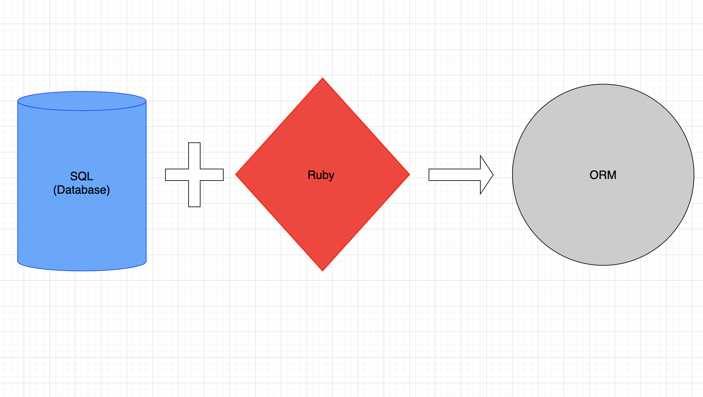

# Intro to Databases

### Lecture Take Aways

- The benefit of databases in applications
- Relationship between a database and an API
- Domain modeling
- Mapping columns and rows to classes and instances
- Basic SQL queries
- Primary Keys
- Foreign Keys

### The bigger picture:

1. ReactJS(frontend) will make a fetch request to an API 
2. API(endpoint) will handle request by communicating and performing queries on database 
3. Response will be returned as a promise and resolved accordingly 
4. ReactJS will re-render with new data 

### Current application problem:

No way of remembering the objects. Although there is an `@@all` array that stores instances, once the application session is over, this collection reverts back to an empty array.
    <details>
    <summary>Solution:</summary>
        Persist and manage data by establishing a database
    </details>

### What tools we have gained so far: 

- Knowledge of Ruby syntax, how to construct classes and create Ruby objects with data and behaviors 

### What we are going to learn over the next few days:

- SQL, ORM, Active Record 

Active Record is a pre-built ORM that uses SQL to perform CRUD actions on data in databases. 



### What is SQL?

- Structured Query Language
- Language used to communicate with and manage databases
- It is a whole science in and of itself. We learn the very basics to understand Active Record better, we can also use basic knowledge to configure and customize database communications outside of conventions

Keywords:

#### CREATE TABLE (establish a table)

```sql
CREATE TABLE tablename(
    id INTEGER PRIMARY KEY,
    attribute TYPE,
    attribute TYPE
)
```

#### SELECT (retrieve)

```sql
SELECT (column name) FROM table_name
```

#### INSERT (persist)

```sql
INSERT INTO table (attribute, attribute, attribute) VALUES (value, value, value)

```

#### UPDATE

```sql
UPDATE table
SET column = ?, column = ?
WHERE id = ?;
```

### What is an ORM

- Object Relational Mapping
- What does that mean? Being able to access our relational databases with a programming language that follows the OO paradigm, in this case, Ruby. 
- Essentially, we're going to combine Ruby and SQL to perform powerful behaviors on our database tables.
- This works by mapping classes and instances to database tables and rows
- CAUTION: Do no mix the two up. While we mimick our Ruby objects as records in the database, they are not the same thing. `Ruby object != database record`
- ORM's solve repetition and organization problems
- Get ready for Active Record!


### Database vs API

- Database is the container that will hold application data
- API is an interface that will communicate database to provide accessibility to parts of data 

### Database Conventions that MUST be followed 

To utilize Active Record efficiently, there is a series of conventions that must be followed

1. Table names will be a lowercased pluralized version of respective class. i.e Donation => donations. If multiple words are involved in class name, snake_casing must be used. i.e. BankAccount => bank_accounts.
2. Column names will be lowercased, singular and snake_cased for multiple words
3. Class name will be a capitalized, singular word. 
4. Foreign key column will be named as: `parent_id`
5. Primary key (id) will be handled by the database, do not set or reassign this value

### What are relational databases

- The ability to set relationships between tables and data. 
- We use a combination of the `primary key` and `foreign key` to define these relationships

Types of common relationships: 

- `belongs_to`: 
    - one to one relationship 
    - This means that one object belongs to another object. 
    - Referred to as child object
    - The table for this object will be responsible for knowing what it belongs to through a foreign key. 
- `has_many`:
    - one to many relationship
    - This is typically a parent object that has a collection of children objects
    - Relative association of `belongs_to`
    - No representation of relationship in table
- `has_many, through`: 
    - Many to many relationship
    - Join table
    - Associated two isolated objects to one another through itself
    - Join table is going to be the child object of the two isolated tables
    - Will typically contain 2 foreign key columns in table
    - Parent objects must have a `has_many` relationship established with the join table before ability to join the two tables

### Domain modeling

- The practice of domain modeling is essentially brainstorming the application domain and structure. 
- What models will the application need?
- Each model will have an associated table
- What columns and types will each respective table need?
- What are the relationships between the tables?
- How does that change the structure of the tables?

- Great tools for domain modeling: draw.io


### Donation tracker domain:

Currently we are building an app that will allow a donor to make a donation to an organization of their choosing. 

1. What models do we need?
    - Donation
    - Organization
    - Donor  
2. What are the associations between the models?
    - Donation: belongs_to :donor, belongs_to :organization, join table 
    - Organization: has_many :donations,  has_many :donors, through :donations 
    - Donor: has_many :donations, has_many :organizations through :donations
3. What columns and types will each models respective table need?
    - donations: amount: integer, date: datetime, completed: boolean, organization_id: integer, donation_id: integer
    - organizations: name:string
    - donors: name: string, email: string
4. What behaviors would we like to provide to each model? 
    - organization: total amount raised

    - donor: return all orgs donated to